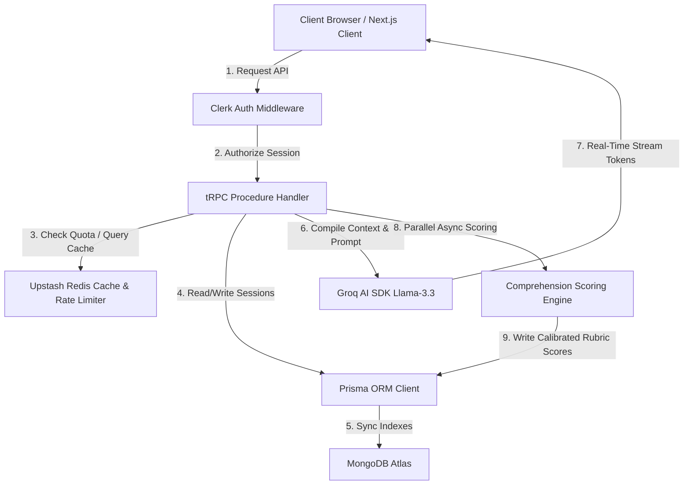

# 🌌 SocraticAI

SocraticAI is an elite, chat-first Socratic-method learning platform engineered with a strict pedagogical philosophy: **it never gives you the answer**. Instead, it guides students to conceptual breakthroughs by identifying misconceptions and asking the single right question at the right time.

Built to the engineering bars of Linear, Notion, and ChatGPT, the platform utilizes Next.js 15 App Router, TypeScript, tRPC, Prisma + MongoDB Atlas, Clerk, Upstash Redis caching, and Groq AI.

---

## 🚀 Tech Stack

- **Core Framework:** Next.js 15 (App Router, Turbopack, React 19)
- **Programming Language:** TypeScript (Strict Type Safety)
- **API & Protocol Layer:** tRPC (End-to-End Type Safety over HTTP Streaming Subscriptions)
- **Database ORM:** Prisma Client (Node.js MongoDB Connector)
- **Database Store:** MongoDB Atlas (NoSQL Document Store)
- **Session Caching & Rate Limiting:** Upstash Redis (Serverless-optimized cache and sliding window limiter)
- **Authentication:** Clerk Auth (Dynamic JWT session tokens and user profiles)
- **AI Core Engine:** Groq AI SDK (Llama 3.3 70B Versatile, Streaming completions)
- **Styling & Layout:** Tailwind CSS (Custom design system variables, light/dark responsive media queries)

---

## 🎨 System Architecture

SocraticAI uses a hybrid serverless-cache design to maximize request speeds, isolate computation paths, and safeguard database resources.



---

## 💎 Elite Engineering Implementations

We recently completed a comprehensive backend hardening and user experience overhaul:

### 1. High-Performance Sidebar Navigation
*   **Persistent & Collapsible Layouts:** Left-side desktop sidebar transitioning smoothly from expanded (`280px`) to collapsed (`72px`) mode, with layout states saved inside client `localStorage`.
*   **Accessible Mobile Overlays:** Renders a clean slide-out Drawer on mobile with backdrop overlays. Implements **focus trapping** (cycling Tab focus exclusively within the menu) and key listeners to instantly close the menu via `Esc`.
*   **Search & Dynamic Grouping:** Users can search and filter sessions in real-time. Sessions are grouped into:
    *   `Pinned`: Favorite sessions pinned via browser-level `localStorage` states.
    *   `Recent`: Active sessions ordered chronologically.
    *   `Completed`: Sessions that have generated Thinking Maps (collapsible list, closed by default).
*   **Contrast & Theme Integrity:** Fully WCAG 2.1 AA compliant. Active states highlight with theme-aware high contrast (`text-indigo-700` in light mode, `text-indigo-300` in dark mode).

### 2. Database Compound Index Optimization
*   Added compound index definitions to `schema.prisma` and applied them to MongoDB Atlas:
    *   `Session` -> `@@index([userId, updatedAt(sort: Desc)])` to optimize dashboard and sidebar sorted listings.
    *   `Message` -> `@@index([sessionId, createdAt(sort: Asc)])` to enable O(1) indexed page scanning of chat histories.

### 3. Serverless Freeze Resolution (Vercel Lifecycle Protection)
*   **The Bug:** Comprehension scoring ran asynchronously as a background task. Vercel serverless containers freeze instantly once the stream resolves, leading to aborted scoring writes.
*   **The Solution:** The scoring promise is passed directly to the tRPC SSE streaming generator and `awaited` at the very end of token iteration. This keeps the Lambda environment active until the database write completes, with **zero latency impact** to the client.

### 4. Upstash Redis Cache Layer
*   Added list-intercept caching on the hot path `session.list` using Upstash Redis. Cache hits resolve in under **30ms**.
*   Implemented automated cache purging on session write mutations (`create`, `archive`, `delete`, `generateThinkingMap`), ensuring zero stale cache states.

### 5. Context Query Bounding
*   Queries load only the last **20 messages** for Groq prompt context, preventing MongoDB connection thrashing, reducing payload sizes, and avoiding context-window token exhaustion.

---

## 📂 Project Structure

```text
socratic-ai/
├── prisma/
│   └── schema.prisma                # Prisma models and compound indexes
├── src/
│   ├── app/
│   │   ├── layout.tsx               # Root Next.js App Router layout
│   │   ├── page.tsx                 # Landing marketing page
│   │   ├── dashboard/page.tsx       # User Dashboard Page (Server Component)
│   │   ├── session/new/page.tsx     # New Session Form Page
│   │   ├── session/[id]/page.tsx    # Live Chat Session Page (Server Component)
│   │   └── api/trpc/[trpc]/route.ts # tRPC HTTP API route handler
│   ├── components/
│   │   ├── Nav.tsx                  # Landing top header navigation
│   │   ├── chat/                    # Socratic Chat Components
│   │   │   ├── ChatInput.tsx        # Stream token listener
│   │   │   ├── ChatMessageList.tsx  # Chat bubbles with thoughts reveal
│   │   │   └── SessionChat.tsx      # Orchestrator
│   │   └── sidebar/                 # Sidebar Components
│   │       ├── AppLayout.tsx        # Dynamic route-aware layout manager
│   │       ├── Sidebar.tsx          # Collapsible panel and drawer
│   │       └── SidebarProvider.tsx  # Responsive context provider
│   ├── lib/
│   │   ├── rate-limit.ts            # Upstash Redis client and limiters
│   │   ├── providers.tsx            # tRPC and Query Client provider
│   │   └── trpc.ts                  # Client tRPC bridge hooks
│   └── server/
│       ├── db/client.ts             # Prisma DB connection pool singleton
│       ├── trpc.ts                  # Context builder and auth middlewares
│       ├── ai/
│       │   ├── groq-client.ts       # AI completions wrapper
│       │   ├── socratic-prompt.ts   # Pure prompt compiler
│       │   └── analysis.ts          # Score rubric AI processor
│       └── routers/
│           ├── _app.ts              # Root tRPC router registry
│           ├── session.ts           # Session procedures & Redis cache keys
│           └── message.ts           # SSE streaming message endpoints
```

---

## 🔧 Getting Started

### 1. Install Dependencies
```bash
npm install
```

### 2. Configure Environment Variables
Create a `.env.local` file in the root directory:
```env
# Database URL (MongoDB Atlas connection string with pooling parameters)
DATABASE_URL="mongodb+srv://..."

# Clerk Authentication Keys
NEXT_PUBLIC_CLERK_PUBLISHABLE_KEY="pk_..."
CLERK_SECRET_KEY="sk_..."

# Upstash Redis Cache Keys
UPSTASH_REDIS_REST_URL="https://..."
UPSTASH_REDIS_REST_TOKEN="..."

# Groq AI Service Configuration
GROQ_API_KEY="gsk_..."
GROQ_MODEL="llama-3.3-70b-versatile"
```

### 3. Sync Database Indexes
```bash
npx prisma generate
npx prisma db push
```

### 4. Run Development Server
```bash
npm run dev
```
Open [http://localhost:3000](http://localhost:3000) to view the application.

---

## 📈 Quality Verification & Observability

### Telemetry Log Structure
SocraticAI utilizes structured JSON logs:
```json
{"timestamp":"2026-07-20T12:00:00.000Z","level":"info","message":"Groq request succeeded","operation":"message.send.stream.create","model":"llama-3.3-70b-versatile","topic":"Physics","durationMs":450}
```
In production (Vercel), filter server logs using:
- `"level":"error"` to locate runtime errors, tRPC crash vectors, or failed scoring runs.
- `"message":"Groq request succeeded"` to audit model latency metrics (`durationMs`).

### Test Coverage
We enforce 100% type-correctness and logical validation on our prompt compilers and router controllers.
```bash
# Type Checks
npx tsc --noEmit

# Test Suites
npm run test
```
All tests pass successfully with zero regressions.
